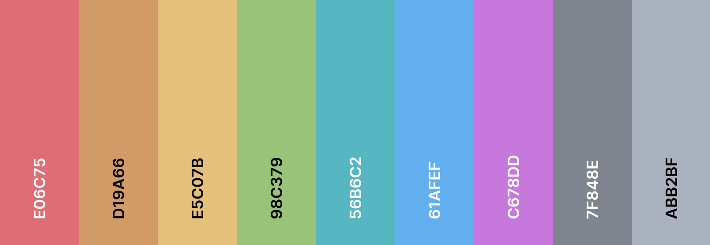

# 🌑 Late Night Code

Minimalist dark theme for Visual Studio Code (VS Code), designed for a comfortable night coding experience. Inspired by [**One Dark**](https://github.com/atom/one-dark-syntax) and [**Default Dark Modern**](https://github.com/microsoft/vscode/blob/main/extensions/theme-defaults/themes/dark_modern.json) themes, every shade of **Late Night** was selected to provide maximum comfort and code readability - even during long night sessions! 😴

<div align="center">
  
  <p>
    <i>Syntax composed of shades of <b>red, orange, yellow, green, cyan, blue, and pink</b>, as well as <b>dark gray and light gray</b> tones, providing a pleasant contrast, essential to any coding session.</i>
  </p>
</div>

# 🚀 Main Features

- **Minimalism**: ⚫️ Designed to be clean and distraction-free, increasing concentration.
- **Visual Comfort**: 🎨 Specially selected tones to reduce eye strain at night.
- **Code Focus**: 💻 Syntax highlighting aimed at providing the best possible readability.

# 🧩 VS Code Extension

- With VS Code open, access the **`Extensions`** menu (or press **`Ctrl + Shift + X`**).
- Search for **`Late Night Code`** and, once found, install the extension by clicking `Install`.
- After installation, click on "⚙️" next to the extension, and select **`Set Color Theme`.**
- Then, choose **`Late Night Code`** from the list of available themes. _And happy hacking!_

# 🛠️ Local Installation

```bash
# Clone the repository
git clone https://github.com/germanocastanho/latenight-code.git

# Navigate to the directory
cd latenight-code

# Install dependencies
sudo apt install nodejs
sudo apt install npm

# Install VS Code Extensions
sudo npm install -g @vscode/vsce

# Package the extension
vsce package

# Install the extension
code --install-extension latenight-code-*.vsix
```

# 📜 Free Software

Distributed under the [**GNU GPL v3**](LICENSE), ensuring freedom - as in "free speech" - to use, modify, and redistribute the software, as long as these freedoms are preserved in any derivative versions. By using or contributing, you support the **free software** philosophy and help build a libertarian technological environment! ✊
